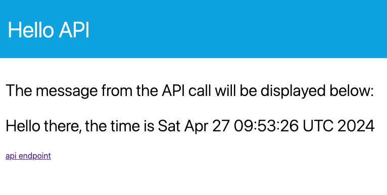

# Hello API

Simple REST api that echoes out a greeting message and the current timestamp. You can adjust the greeting message by adding an environment variable GREETING_MESSAGE (defaults to "there"). The color of the banner is adjustable with the environment variable COLOR (defaults to "blue"). The api endpoint url is adjustable with the environment variable API_URL (defaults to "./hello")

The api is accessable on the /hello endpoint. The service has a simple web ui that calls this enpoint and render the response.

